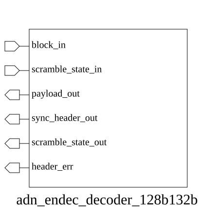

# adn_endec_decoder_128b132b (module)

### Author : Foez Ahmed (foez.official@gmail.com)

## TOP IO

## Parameters
|Name|Type|Dimension|Default Value|Description|
|-|-|-|-|-|

## Ports
|Name|Direction|Type|Dimension|Description|
|-|-|-|-|-|
|block_in|input|logic [131:0]||Raw 132-bit input block|
|scramble_state_in|input|logic [ 22:0]||Input 23-bit scrambler state|
|payload_out|output|logic [127:0]||Decoded 128-bit payload|
|sync_header_out|output|logic [ 3:0]||Extracted 4-bit sync header|
|scramble_state_out|output|logic [ 22:0]||Updated 23-bit scrambler state|
|header_err|output|logic||Sync header validation error flag|
## Description

### Purpose
The `adn_endec_decoder_128b132b` module is designed to perform 128b/132b decoding for high-speed serial data streams. It extracts the 4-bit synchronization header and descrambles the 128-bit payload using a provided scramble state, while also validating the sync header to detect potential transmission errors.

### Usage
To use this module, connect the 132-bit raw data stream to `block_in` and provide the current 23-bit `scramble_state_in` used for the descrambling process. The module will output the decoded 128-bit payload via `payload_out` and the extracted 4-bit sync header via `sync_header_out`. The `scramble_state_out` provides the updated state for the next cycle, and `header_err` indicates if the sync header is invalid.

| REVISION | DATE       | AUTHOR          | DESCRIPTION                                            |
|----------|------------|-----------------|--------------------------------------------------------|
| 1.0      | 2026-07-29 | Foez Ahmed      | Stable release                                         |

This file is part of ADN-VLSI/adn_endec
 **Copyright (c) 2026 ADN Semiconductors**
 **Licensed under the MIT License**
 **See LICENSE file in the project root for full license information**

