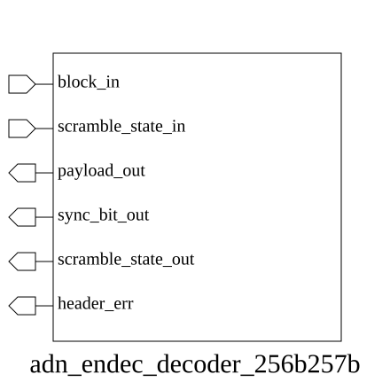

# adn_endec_decoder_256b257b (module)

### Author : Foez Ahmed (foez.official@gmail.com)

## TOP IO

## Parameters
|Name|Type|Dimension|Default Value|Description|
|-|-|-|-|-|

## Ports
|Name|Direction|Type|Dimension|Description|
|-|-|-|-|-|
|block_in|input|logic [256:0]||257-bit encoded input block (1-bit sync + 256-bit payload)|
|scramble_state_in|input|logic [ 22:0]||Current 23-bit scrambler state for descrambling|
|payload_out|output|logic [255:0]||Decoded 256-bit data payload|
|sync_bit_out|output|logic||Extracted synchronization header bit|
|scramble_state_out|output|logic [ 22:0]||Updated 23-bit scrambler state for next cycle|
|header_err|output|logic||Error flag indicating invalid sync header|
## Description

### Purpose
This module implements a 256b/257b decoder designed for high-speed serial data streams. It extracts the 256-bit payload from a 257-bit encoded block, performs descrambling based on the provided state, and validates the synchronization header bit to detect potential transmission errors.

### Usage
To use this module, connect the 257-bit encoded input stream to `block_in` and provide the current 23-bit scrambler state via `scramble_state_in`. The module will output the decoded 256-bit payload, the extracted sync bit, the updated scrambler state for the next cycle, and a `header_err` flag if the sync bit is invalid.

| REVISION | DATE       | AUTHOR          | DESCRIPTION                                            |
|----------|------------|-----------------|--------------------------------------------------------|
| 1.0      | 2026-07-29 | Foez Ahmed      | Stable release                                         |

This file is part of ADN-VLSI/adn_endec
 **Copyright (c) 2026 ADN Semiconductors**
 **Licensed under the MIT License**
 **See LICENSE file in the project root for full license information**

