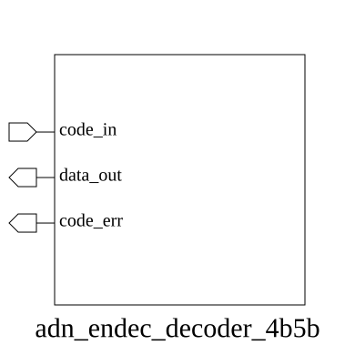

# adn_endec_decoder_4b5b (module)

### Author : Foez Ahmed (foez.official@gmail.com)

## TOP IO

## Parameters
|Name|Type|Dimension|Default Value|Description|
|-|-|-|-|-|

## Ports
|Name|Direction|Type|Dimension|Description|
|-|-|-|-|-|
|code_in|input|logic [4:0]||5-bit encoded input symbol|
|data_out|output|logic [3:0]||4-bit decoded data output|
|code_err|output|logic||Error flag: high if input symbol is invalid|
## Description

# Purpose
This module implements a 4b5b decoder, which converts a 5-bit encoded symbol back into its original 4-bit data representation. It includes error detection to identify invalid 5-bit symbols that do not map to valid 4-bit data.

## Usage
To use this module, connect a 5-bit encoded symbol to the `code_in` port. The module will output the corresponding 4-bit data on `data_out` and assert `code_err` if the input symbol is invalid.

| REVISION | DATE       | AUTHOR          | DESCRIPTION                                            |
|----------|------------|-----------------|--------------------------------------------------------|
| 1.0      | YYYY-MM-DD | Foez Ahmed      | Stable release                                         |

This file is part of ADN-VLSI/adn_endec
 **Copyright (c) 2026 ADN Semiconductors**
 **Licensed under the MIT License**
 **See LICENSE file in the project root for full license information**

