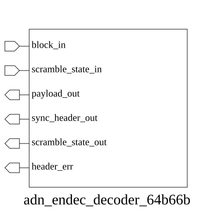

# adn_endec_decoder_64b66b (module)

### Author : Foez Ahmed (foez.official@gmail.com)

## TOP IO

## Parameters
|Name|Type|Dimension|Default Value|Description|
|-|-|-|-|-|

## Ports
|Name|Direction|Type|Dimension|Description|
|-|-|-|-|-|
|block_in|input|logic [65:0]||66-bit encoded input block|
|scramble_state_in|input|logic [57:0]||Current 58-bit scrambling state|
|payload_out|output|logic [63:0]||Decoded 64-bit payload|
|sync_header_out|output|logic [ 1:0]||Extracted 2-bit sync header|
|scramble_state_out|output|logic [57:0]||Updated 58-bit scrambling state|
|header_err|output|logic||High if sync header is invalid|
## Description

This module implements a 64b/66b decoder designed to process encoded data blocks. It performs synchronization header extraction, payload descrambling using a provided state, and validation of the sync header to detect transmission errors.

### Usage

The `adn_endec_decoder_64b66b` module is used to decode 66-bit blocks into 64-bit data payloads.

1. **Input**: Provide the 66-bit encoded block to `block_in` and the current 58-bit scrambling state to `scramble_state_in`.
2. **Processing**: The module extracts the 2-bit sync header and descrambles the 64-bit payload using the provided state.
3. **Output**: The decoded 64-bit payload is available at `payload_out`, the sync header at `sync_header_out`, and the updated scrambling state at `scramble_state_out`.
4. **Error Detection**: The `header_err` signal asserts high if the sync header is invalid (i.e., not `2'b01` or `2'b10`).

| REVISION | DATE       | AUTHOR          | DESCRIPTION                                            |
|----------|------------|-----------------|--------------------------------------------------------|
| 1.0      | 2026-07-29 | Foez Ahmed      | Stable release                                         |

This file is part of ADN-VLSI/adn_endec
 **Copyright (c) 2026 ADN Semiconductors**
 **Licensed under the MIT License**
 **See LICENSE file in the project root for full license information**

