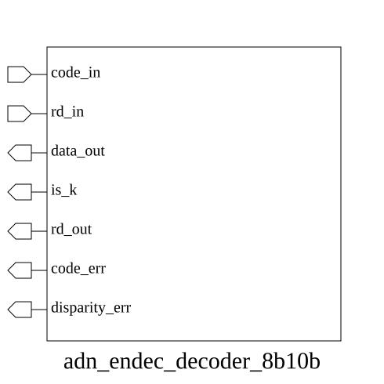

# adn_endec_decoder_8b10b (module)

### Author : Foez Ahmed (foez.official@gmail.com)

## TOP IO

## Parameters
|Name|Type|Dimension|Default Value|Description|
|-|-|-|-|-|

## Ports
|Name|Direction|Type|Dimension|Description|
|-|-|-|-|-|
|code_in|input|logic [9:0]||10-bit input symbol to be decoded|
|rd_in|input|logic||Current Running Disparity (0: negative, 1: positive)|
|data_out|output|logic [7:0]||Decoded 8-bit data byte|
|is_k|output|logic||High if the decoded symbol is a K-code (control character)|
|rd_out|output|logic||Updated Running Disparity for the next symbol|
|code_err|output|logic||High if the input symbol is invalid|
|disparity_err|output|logic||High if a disparity violation is detected|
## Description

### Purpose
This module implements an 8b/10b decoder, which converts 10-bit encoded symbols back into their original 8-bit data bytes or control characters (K-codes). It performs disparity tracking and error detection to ensure the integrity of the received line-coded data.

### Usage
To use this module, provide the 10-bit encoded symbol to `code_in` and the current Running Disparity (RD) state to `rd_in`. The module will output the decoded 8-bit value on `data_out`. If the symbol represents a control character, `is_k` will be asserted. The `rd_out` signal provides the updated disparity for the next symbol. Error flags `code_err` and `disparity_err` indicate invalid symbols or disparity violations, respectively.

| REVISION | DATE       | AUTHOR          | DESCRIPTION                                            |
|----------|------------|-----------------|--------------------------------------------------------|
| 1.0      | 2026-07-29 | Foez Ahmed      | Stable release                                         |

This file is part of ADN-VLSI/adn_endec
 **Copyright (c) 2026 ADN Semiconductors**
 **Licensed under the MIT License**
 **See LICENSE file in the project root for full license information**

