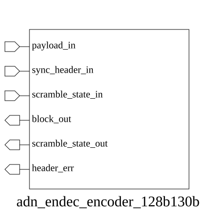

# adn_endec_encoder_128b130b (module)

### Author : Foez Ahmed (foez.official@gmail.com)

## TOP IO

## Parameters
|Name|Type|Dimension|Default Value|Description|
|-|-|-|-|-|

## Ports
|Name|Direction|Type|Dimension|Description|
|-|-|-|-|-|
|payload_in|input|logic [127:0]||Raw 128-bit data payload|
|sync_header_in|input|logic [ 1:0]||2-bit synchronization header|
|scramble_state_in|input|logic [ 22:0]||Current 23-bit scrambling state|
|block_out|output|logic [129:0]||Encoded 130-bit output block|
|scramble_state_out|output|logic [ 22:0]||Updated 23-bit scrambling state|
|header_err|output|logic||Error flag for invalid sync header|
## Description

### Purpose
The `adn_endec_encoder_128b130b` module implements a 128b/130b encoder as specified in the IEEE 802.3 standard. It accepts a 128-bit payload and a 2-bit synchronization header, performs payload scrambling using a provided state, and outputs a 130-bit encoded block along with the updated scrambling state and a header validity check.

### Usage
To use this module, instantiate it in your design and provide the 128-bit data payload, the 2-bit synchronization header, and the current 23-bit scrambling state. The module will output the 130-bit encoded block (header + scrambled payload) and the updated scrambling state for the next cycle. The `header_err` output indicates if the provided synchronization header is invalid according to the standard.

| REVISION | DATE       | AUTHOR          | DESCRIPTION                                            |
|----------|------------|-----------------|--------------------------------------------------------|
| 1.0      | 2026-07-29 | Foez Ahmed      | Stable release                                         |

This file is part of ADN-VLSI/adn_endec
 **Copyright (c) 2026 ADN Semiconductors**
 **Licensed under the MIT License**
 **See LICENSE file in the project root for full license information**

