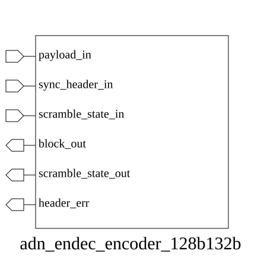

# adn_endec_encoder_128b132b (module)

### Author : Foez Ahmed (foez.official@gmail.com)

## TOP IO

## Parameters
|Name|Type|Dimension|Default Value|Description|
|-|-|-|-|-|

## Ports
|Name|Direction|Type|Dimension|Description|
|-|-|-|-|-|
|payload_in|input|logic [127:0]||Raw 128-bit data payload|
|sync_header_in|input|logic [ 3:0]||4-bit synchronization header|
|scramble_state_in|input|logic [ 22:0]||Current 23-bit LFSR scrambling state|
|block_out|output|logic [131:0]||Final 132-bit encoded output block|
|scramble_state_out|output|logic [ 22:0]||Updated 23-bit LFSR scrambling state|
|header_err|output|logic||Error flag for invalid sync header|
## Description

### Purpose
The `adn_endec_encoder_128b132b` module implements a 128b/132b line coding encoder. It takes a 128-bit payload and a 4-bit synchronization header, applies scrambling based on a provided state, and outputs a 132-bit encoded block suitable for high-speed serial transmission.

### Usage
To use this module, instantiate it in your top-level design. Provide the 128-bit data payload, the 4-bit synchronization header (e.g., 2'b01 for data or 2'b10 for control), and the current 23-bit scrambling state. The module will output the 132-bit encoded block and the updated scrambling state for the next cycle. The `header_err` signal will assert if an invalid synchronization header is detected.

| REVISION | DATE       | AUTHOR          | DESCRIPTION                                            |
|----------|------------|-----------------|--------------------------------------------------------|
| 1.0      | 2026-07-29 | Foez Ahmed      | Stable release                                         |

This file is part of ADN-VLSI/adn_endec
 **Copyright (c) 2026 ADN Semiconductors**
 **Licensed under the MIT License**
 **See LICENSE file in the project root for full license information**

