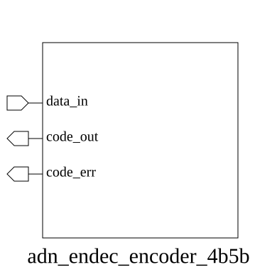

# adn_endec_encoder_4b5b (module)

### Author : Foez Ahmed (foez.official@gmail.com)

## TOP IO

## Parameters
|Name|Type|Dimension|Default Value|Description|
|-|-|-|-|-|

## Ports
|Name|Direction|Type|Dimension|Description|
|-|-|-|-|-|
|data_in|input|logic [3:0]||4-bit input data to be encoded|
|code_out|output|logic [4:0]||5-bit encoded output symbol|
|code_err|output|logic||Error flag: high if input symbol is invalid|
## Description

### Purpose
This module implements a 4b5b line encoder, which maps 4-bit input data symbols to 5-bit output codes. This encoding scheme is commonly used in data communication protocols to ensure sufficient transition density for clock recovery and to provide error detection capabilities.

### Usage
To use this module, connect a 4-bit data bus to `data_in`. The module will output the corresponding 5-bit 4b5b encoded symbol on `code_out`. If the input symbol is invalid (e.g., in protocols where certain 4-bit combinations are reserved), the `code_err` signal will be asserted high. The encoding logic is handled by the included `adn_endec_block_linecode_functions.svh` file.

| REVISION | DATE       | AUTHOR          | DESCRIPTION                                            |
|----------|------------|-----------------|--------------------------------------------------------|
| 1.0      | 2026-07-29 | Foez Ahmed      | Stable release                                         |

This file is part of ADN-VLSI/adn_endec
 **Copyright (c) 2026 ADN Semiconductors**
 **Licensed under the MIT License**
 **See LICENSE file in the project root for full license information**

