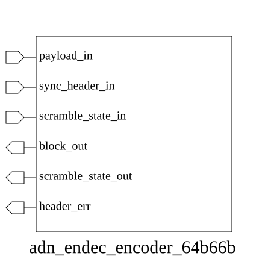

# adn_endec_encoder_64b66b (module)

### Author : Foez Ahmed (foez.official@gmail.com)

## TOP IO

## Parameters
|Name|Type|Dimension|Default Value|Description|
|-|-|-|-|-|

## Ports
|Name|Direction|Type|Dimension|Description|
|-|-|-|-|-|
|payload_in|input|logic [63:0]||Raw 64-bit data input|
|sync_header_in|input|logic [ 1:0]||2-bit synchronization header (e.g., 01 for data, 10 for control)|
|scramble_state_in|input|logic [57:0]||Current 58-bit LFSR scramble state|
|block_out|output|logic [65:0]||Final 66-bit encoded block (2-bit header + 64-bit scrambled data)|
|scramble_state_out|output|logic [57:0]||Next cycle 58-bit LFSR scramble state|
|header_err|output|logic||Flag indicating an invalid sync header pattern|
## Description

### Purpose
This module implements a 64b/66b encoder used in high-speed serial communication protocols. It performs data scrambling on a 64-bit payload using a provided scramble state and appends a 2-bit synchronization header to produce a 66-bit encoded block, while also validating the sync header.

### Usage
To use this module, provide a 64-bit data payload, a 2-bit synchronization header, and the current 58-bit scramble state. The module will output the 66-bit encoded block, the updated scramble state for the next cycle, and a header error flag if the sync header is invalid.

| REVISION | DATE       | AUTHOR          | DESCRIPTION                                            |
|----------|------------|-----------------|--------------------------------------------------------|
| 1.0      | 2026-07-29 | Foez Ahmed      | Stable release                                         |

This file is part of ADN-VLSI/adn_endec
 **Copyright (c) 2026 ADN Semiconductors**
 **Licensed under the MIT License**
 **See LICENSE file in the project root for full license information**

