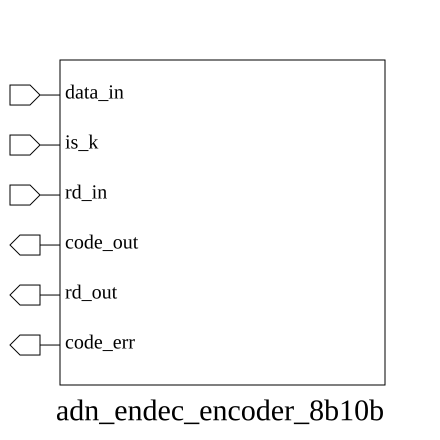

# adn_endec_encoder_8b10b (module)

### Author : Foez Ahmed (foez.official@gmail.com)

## TOP IO

## Parameters
|Name|Type|Dimension|Default Value|Description|
|-|-|-|-|-|

## Ports
|Name|Direction|Type|Dimension|Description|
|-|-|-|-|-|
|data_in|input|logic [7:0]||8-bit input data byte|
|is_k|input|logic||Control character indicator (1: K-code, 0: D-code)|
|rd_in|input|logic||Current Running Disparity (0: negative, 1: positive)|
|code_out|output|logic [9:0]||10-bit encoded output symbol|
|rd_out|output|logic||Updated Running Disparity|
|code_err|output|logic||Error flag (1: invalid input combination)|
## Description

### Purpose
The `adn_endec_encoder_8b10b` module implements an 8b/10b encoder, which converts 8-bit data bytes into 10-bit symbols. This encoding scheme is widely used in high-speed serial communication protocols to ensure DC balance and provide sufficient transition density for clock recovery.

### Usage
To use this module, provide an 8-bit data byte at `data_in` and set `is_k` high if the input is a control character (K-code) or low for data characters (D-code). The `rd_in` signal represents the current Running Disparity (RD) state. The module outputs the 10-bit encoded symbol at `code_out`, the updated running disparity at `rd_out`, and an error flag `code_err` if the input combination is invalid.

| REVISION | DATE       | AUTHOR          | DESCRIPTION                                            |
|----------|------------|-----------------|--------------------------------------------------------|
| 1.0      | 2026-07-29 | Foez Ahmed      | Stable release                                         |

This file is part of ADN-VLSI/adn_endec
 **Copyright (c) 2026 ADN Semiconductors**
 **Licensed under the MIT License**
 **See LICENSE file in the project root for full license information**

