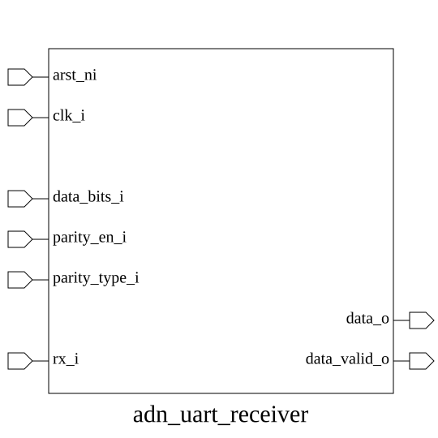

# adn_uart_receiver (module)

### Author: Ahasan Ullah Khalid (aukhalid02@gmail.com)

### Source: adn_uart_receiver.sv

## Top IO

## Parameters

|Name|Type|Dimension|Default|Description|
|-|-|-|-|-|
|OVERSAMPLE|int||8|Number of samples per bit period|

## Ports

|Name|Direction|Type|Dimension|Description|
|-|-|-|-|-|
|arst_ni|input|logic||Asynchronous reset, active low|
|clk_i|input|logic||System clock input|
|data_bits_i|input|logic [1:0]||Data length config (0:5b, 1:6b, 2:7b, 3:8b)|
|parity_en_i|input|logic||Parity check enable|
|parity_type_i|input|logic||Parity type (0:even, 1:odd)|
|rx_i|input|logic||Raw serial receive input|
|data_o|output|logic [7:0]||Parallel received data output|
|data_valid_o|output|logic||Pulse indicating valid data on data_o|

## Description

# Purpose
This module implements a configurable UART receiver designed to deserialize incoming serial data streams. It supports variable data lengths (5 to 8 bits), optional parity checking (even/odd), and oversampling to ensure robust clock domain synchronization and bit-center sampling.

### Use Case
The `adn_uart_receiver` is designed for integration into SoC or FPGA designs requiring asynchronous serial communication. It is typically used to interface with external peripherals, sensors, or debug consoles that transmit data using the standard UART protocol. By providing configurable data widths and parity, it offers flexibility for various communication standards (e.g., RS-232, RS-485) while ensuring reliable data capture through oversampling and synchronization logic.

| REVISION | DATE       | AUTHOR          | DESCRIPTION                                            |
|----------|------------|-----------------|--------------------------------------------------------|
| 0.1      | 2026-08-06 | Ahasan Ullah Khalid | Initial version                                        |
| 1.0      | 2026-08-06 | Ahasan Ullah Khalid | Stable release                                         |

Author : Ahasan Ullah Khalid (aukhalid02@gmail.com)
