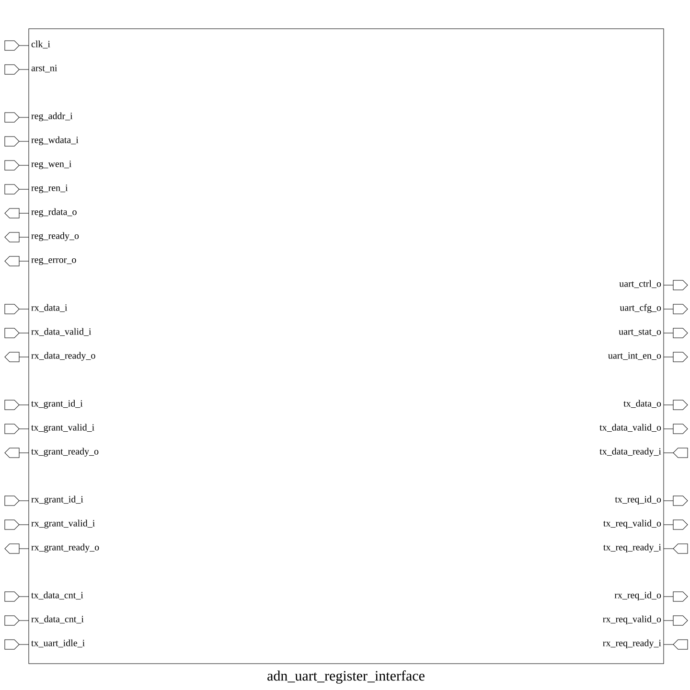

# adn_uart_register_interface (module)

### Author: Ahasan Ullah Khalid (aukhalid02@gmail.com)

### Source: adn_uart_register_interface.sv

## Top IO

## Parameters

|Name|Type|Dimension|Default|Description|
|-|-|-|-|-|
|ADDR_WIDTH|int||32|Width of the register address bus|
|DATA_WIDTH|int||32|Width of the register data bus|
|RST_CLK_DIV|logic [11:0]||12'h05B|Reset value for clock divider|
|RST_PRESCALER|logic [ 3:0]||4'h4|Reset value for prescaler|
|RST_DATA_BITS|logic [ 1:0]||2'h3|Reset value for data bits configuration|
|RST_PARITY_EN|logic||1'b0|Reset value for parity enable|
|RST_PARITY_TY|logic||1'b0|Reset value for parity type|
|RST_STOP_BITS|logic||1'b0|Reset value for stop bits configuration|

## Ports

|Name|Direction|Type|Dimension|Description|
|-|-|-|-|-|
|clk|input|logic||System clock|
|rst_n|input|logic||Active-low asynchronous reset|
|reg_addr|input|logic [ADDR_WIDTH-1:0]||Register address input|
|reg_wdata|input|logic [DATA_WIDTH-1:0]||Write data input|
|reg_write_en|input|logic||Write enable signal|
|reg_read_en|input|logic||Read enable signal|
|reg_rdata|output|logic [DATA_WIDTH-1:0]||Read data output|
|reg_ready|output|logic||Bus ready signal|
|reg_error|output|logic||Bus error signal|
|uart_sw_rst|output|logic||Software reset trigger|
|tx_fifo_flush|output|logic||Flush TX FIFO|
|rx_fifo_flush|output|logic||Flush RX FIFO|
|tx_en|output|logic||Transmitter enable|
|rx_en|output|logic||Receiver enable|
|clk_div|output|logic [11:0]||Clock divider value|
|prescaler|output|logic [ 3:0]||Prescaler value|
|data_bits|output|logic [ 1:0]||Data bits configuration|
|parity_en|output|logic||Parity enable|
|parity_type|output|logic||Parity type selection|
|stop_bits|output|logic||Stop bits configuration|
|tx_data_cnt|input|logic [9:0]||TX FIFO data count|
|rx_data_cnt|input|logic [9:0]||RX FIFO data count|
|tx_fifo_empty|input|logic||TX FIFO empty status|
|tx_fifo_full|input|logic||TX FIFO full status|
|rx_fifo_empty|input|logic||RX FIFO empty status|
|rx_fifo_full|input|logic||RX FIFO full status|
|tx_fifo_wdata|output|logic [7:0]||Data to write to TX FIFO|
|tx_fifo_push|output|logic||Push data to TX FIFO|
|rx_fifo_rdata|input|logic [7:0]||Data read from RX FIFO|
|rx_fifo_pop|output|logic||Pop data from RX FIFO|
|tx_access_req_id|output|logic [7:0]||TX request ID|
|tx_req_valid|output|logic||TX request valid|
|tx_grant_id|input|logic [7:0]||TX grant ID|
|tx_grant_valid|input|logic||TX grant valid|
|tx_grant_pop|output|logic||Pop TX grant|
|rx_access_req_id|output|logic [7:0]||RX request ID|
|rx_req_valid|output|logic||RX request valid|
|rx_grant_id|input|logic [7:0]||RX grant ID|
|rx_grant_valid|input|logic||RX grant valid|
|rx_grant_pop|output|logic||Pop RX grant|
|tx_fifo_empty_int_en|output|logic||TX empty interrupt enable|
|tx_fifo_full_int_en|output|logic||TX full interrupt enable|
|rx_fifo_empty_int_en|output|logic||RX empty interrupt enable|
|rx_fifo_full_int_en|output|logic||RX full interrupt enable|

## Description

The `adn_uart_register_interface` module serves as the primary bridge between a system-level bus interface (such as APB) and the internal UART hardware components. It maps control, configuration, status, and data registers to specific memory addresses, enabling software to manage UART operations, monitor FIFO status, handle arbitration requests, and configure communication parameters like clock division and parity.

### Use Case
The `adn_uart_register_interface` acts as the memory-mapped control layer for the UART peripheral. Its primary use cases include:
- **Configuration:** Allowing software to set baud rates (via clock division/prescalers) and frame formats (data bits, parity, stop bits).
- **Control:** Providing a mechanism to trigger software resets, flush FIFOs, and enable/disable the transmitter and receiver.
- **Data Transfer:** Facilitating the movement of data between the system bus and the TX/RX FIFOs.
- **Status Monitoring:** Exposing real-time FIFO occupancy and status flags to the CPU.
- **Arbitration:** Managing request/grant handshakes for multi-master or multi-client UART access scenarios.

| REVISION | DATE       | AUTHOR              | DESCRIPTION                                            |
|----------|------------|---------------------|--------------------------------------------------------|
| 0.1      | 2026-08-16 | Ahasan Ullah Khalid | Initial version                                        |
| 1.0      | 2026-08-16 | Ahasan Ullah Khalid | Stable release                                         |

Author : Ahasan Ullah Khalid (aukhalid02@gmail.com)
