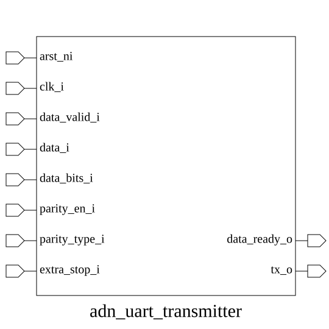

# adn_uart_transmitter (module)

### Author: Annim Jannat (jannatannim@gmail.com)

### Source: adn_uart_transmitter.sv

## Top IO

## Parameters

|Name|Type|Dimension|Default|Description|
|-|-|-|-|-|
|DATA_WIDTH|int||8|Width of the input data bus|

## Ports

|Name|Direction|Type|Dimension|Description|
|-|-|-|-|-|
|arst_ni|input|logic||asynchronous reset, active low|
|clk_i|input|logic||clock input|
|data_ready_o|output|logic||High when transmitter is ready to accept new data|
|data_valid_i|input|logic||High when input data is valid|
|data_i|input|logic [7:0]||Parallel data to be transmitted|
|data_bits_i|input|logic [1:0]||Number of data bits (0:5b, 1:6b, 2:7b, 3:8b)|
|parity_en_i|input|logic||Enable parity bit generation|
|parity_type_i|input|logic||Parity type (0:even, 1:odd)|
|extra_stop_i|input|logic||Enable second stop bit|
|tx_o|output|logic||Serialized UART output bitstream|

## Description

### Purpose
This module implements a configurable Universal Asynchronus Receiver-Transmitter (UART) transmitter. It serializes parallel data into a bitstream with support for variable data lengths (5-8 bits), optional parity generation (even/odd), and selectable stop bit configurations.

### Use Case
This module is designed for embedded systems and FPGA-based designs requiring low-speed serial communication. It serves as the primary interface for transmitting data from a parallel bus (e.g., CPU or internal logic) to external peripherals like sensors, debug consoles, or other microcontrollers. By providing configurable data widths, parity, and stop bits, it ensures compatibility with standard UART protocols across diverse hardware environments.

| REVISION | DATE       | AUTHOR          | DESCRIPTION                                            |
|----------|------------|-----------------|--------------------------------------------------------|
| 0.1      | 2026-08-04 | Annim Jannat    | Initial version                                        |
| 1.0      | 2026-08-06 | Annim Jannat    | Stable release                                         |

Author : Annim Jannat (jannatannim@gmail.com)
